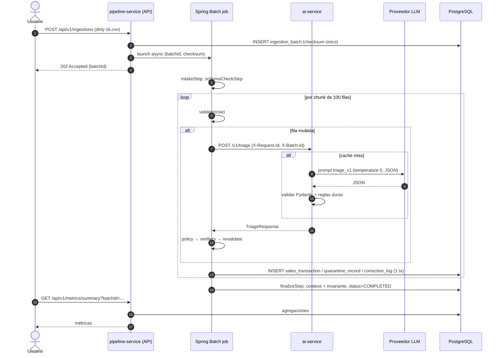

# 04 — Arquitectura

## 1. Vista general

```
                         ┌───────────────────────────────────────────────────────────┐
                         │                    docker compose (proyecto: pipemend)      │
                         │                                                            │
  Usuario / Evaluador    │   ┌──────────────────────────────┐   HTTP/JSON (sync)      │
  (curl, Swagger UI)     │   │      pipeline-service        │   POST /v1/triage       │
 ───────────────────────────▶│  Spring Boot + Spring Batch  │──────────────────────┐  │
  :8080  /api/v1/...     │   │                              │   POST /v1/schema-    │  │
                         │   │  • API REST (ingesta,        │        drift/analyze  │  │
                         │   │    estado, métricas)         │◀──────────────────┐   │  │
                         │   │  • Job ETL (E → T/V → L)     │   JSON estructurado│   ▼  │
                         │   │  • Validador + Política +    │   ┌──────────────────────┐│
                         │   │    Verificadores             │   │     ai-service       ││
                         │   │  • Resilience4j              │   │  FastAPI (Python)    ││
                         │   └──────────────┬───────────────┘   │                      ││
                         │                  │ JDBC              │ • Prompts versionados││
                         │                  ▼                   │ • Caché en memoria   ││
                         │   ┌──────────────────────────────┐   │ • Validación Pydantic││
                         │   │        PostgreSQL 18         │   │ • LLMProvider:       ││
                         │   │ • sales_transaction (limpio) │   │   mock | openai_     ││
                         │   │ • quarantine_record          │   │   compatible |       ││
                         │   │ • correction_log             │   │   anthropic          ││
                         │   │ • ingestion_batch            │   └──────────┬───────────┘│
                         │   │ • ai_call_log                │              │            │
                         │   │ • BATCH_* (Spring Batch)     │              │ HTTPS      │
                         │   └──────────────────────────────┘              │ (opcional) │
                         │   volumen: pgdata    volumen: inbox             │            │
                         └─────────────────────────────────────────────────┼────────────┘
                                                                           ▼
                                                        Proveedor LLM externo o local
                                                        (OpenAI-compatible, Anthropic,
                                                         Ollama...) — nunca en tests
  :8000 /docs (Swagger del ai-service, expuesto para la demo)
```

### Responsabilidades y límites (no negociables sin ADR)

| Componente | Hace | NO hace |
|---|---|---|
| `pipeline-service` | Recibe archivos, orquesta el job, valida, decide (política), verifica, corrige, carga, expone métricas. **Único** dueño de la base de datos. | No construye prompts ni llama a proveedores LLM directamente. |
| `ai-service` | Construye prompts, llama al LLM, valida y normaliza la salida, aplica reglas duras de clasificación (AC-08.3), cachea. | No accede a la base de datos. No decide qué se escribe. No guarda estado persistente. |
| `postgres` | Persistencia de datos limpios, cuarentena, auditoría y metadata de Spring Batch. | No contiene lógica (sin triggers ni procedimientos de negocio). |

Comunicación: **HTTP/JSON síncrono** de `pipeline-service` a `ai-service`. No hay colas, ni comunicación en sentido inverso. Ver ADR-0002.

## 2. Por qué ETL y no ELT

Resumen (detalle en `adr/0001-etl-sobre-elt.md`):

- **El valor del producto está en decidir antes de persistir.** La tabla limpia debe contener solo datos que pasaron validación. En ELT, los datos crudos se cargan primero y se transforman dentro del warehouse; los errores se descubren tarde y los datos sucios ya viven en el destino.
- **La corrección requiere lógica imperativa y llamadas externas** (servicio de IA, verificadores, política con umbrales). Eso es natural en un procesador de Spring Batch y forzado en SQL/dbt.
- **Contrato de calidad en la frontera:** los consumidores de `sales_transaction` pueden confiar en tipos y reglas sin revalidar.
- **Volumen de portafolio:** no hay necesidad de la escalabilidad de cómputo de un warehouse que justifica ELT.
- Se conserva el crudo **solo** para registros en cuarentena (`raw_payload`), por auditoría; no existe una capa "raw" completa. ELT/dbt queda como fase 2 posible.

## 3. Estructura del job de Spring Batch

```
ingestionJob  (parámetros identificadores: batchId, sourceChecksum)
│
├── 1. intakeStep            (Tasklet)
│      • verifica que el archivo exista en /data/inbox/{batchId}/
│      • detecta formato (CSV/JSON), lee cabeceras (quita BOM, rechaza duplicadas)
│      • cuenta los registros con el MISMO parser del lector → ingestion_batch.read_count  [NFR-06]
│      • marca ingestion_batch.status = RUNNING
│
├── 2. schemaCheckStep       (Tasklet)                          [FR-05]
│      • cabeceras == esperadas → mapeo identidad
│      • si no: normalización determinista
│      • si quedan sin resolver: POST /v1/schema-drift/analyze → SchemaMappingPolicy
│      • OK → guarda mapeo en ExecutionContext + ingestion_batch.schema_mapping
│      • NO → status = REJECTED, schema_drift_report, el job termina (ExitStatus REJECTED)
│
├── 3. processRecordsStep    (chunk-oriented, commit-interval = 100)
│      Reader:    RawRecordReader (CSV streaming / JSON streaming) → RawRecord
│                 (nunca lanza por contenido; filas malformadas se marcan;
│                  implementa ItemStream: guarda/restaura posición para reinicio)
│      Processor: RecordProcessor → ProcessedRecord (ver §4)
│      Writer:    ClassifierCompositeItemWriter
│                   ├─ DIRECT / AUTO_CORRECTED → SalesTransactionWriter (+ CorrectionLogWriter)
│                   └─ QUARANTINED            → QuarantineWriter
│      (sin skip policy; excepciones por registro → PROCESSING_ERROR)
│
└── 4. finalizeStep          (Tasklet)
       • calcula conteos desde las tablas
       • verifica invariante (NFR-06: suma, exclusión mutua, sin huecos 1..read_count)
       • status = COMPLETED (o FAILED con INVARIANT_VIOLATION)
```

- El job se lanza de forma **asíncrona** con `JobOperator` sobre un `TaskExecutor` de **un solo hilo** con cola (NFR-10); el endpoint responde `202` con `status = RECEIVED` o `RUNNING`. <!-- rev: R-28 -->
- Un `JobExecutionListener` actualiza `ingestion_batch` ante fallas (`FAILED` + `failureReason`). La correspondencia de estados Spring Batch ↔ `ingestion_batch` está en `02` §5.
- Parámetros identificadores: `batchId` y `sourceChecksum`, lo que habilita el reinicio (FR-21).
- **Reconciliación de arranque** (AC-04.6): un `ApplicationRunner` busca lotes `RUNNING` cuya `JobExecution` quedó `STARTED`, llama a `JobOperator.recover(...)` y marca el lote `FAILED`/`INTERRUPTED`; reencola los `RECEIVED` sin ejecución. <!-- rev: R-12 -->

<!-- rev: R-16 -->
### 3.1 Trampas de Spring Boot 4 / Spring Batch 6 que afectan esta arquitectura

| Trampa | Consecuencia si se ignora | Regla |
|---|---|---|
| En Boot 4, `spring-boot-starter-batch` configura un repositorio de jobs **sin recursos (en memoria)**; el repositorio JDBC está en `spring-boot-starter-batch-jdbc` | El job "funciona", pero la metadata no se persiste: el reinicio (FR-21), la reconciliación (AC-04.6) y la idempotencia de reinicio no funcionan, sin ningún error visible | Usar `spring-boot-starter-batch-jdbc`. Test de integración que verifica filas en `BATCH_JOB_EXECUTION` tras un job |
| Tablas `BATCH_*` creadas por Spring Batch y además por Flyway | Conflicto o doble creación | **Decisión (antes "se decide en Sprint 2"):** Flyway `V1__spring_batch_schema.sql` con el `schema-postgresql.sql` copiado del jar de la versión exacta de Spring Batch fijada, y `spring.batch.jdbc.initialize-schema=never`. Si se sube la versión de Batch, se revisa si su script cambió y se agrega una migración nueva |
| Flyway 10+ separa el soporte por base de datos | `No database found to handle jdbc:postgresql` al arrancar | Agregar `org.flywaydb:flyway-database-postgresql` (versión gestionada por el BOM de Boot) |
| `FlatFileItemReader` + `DelimitedLineTokenizer.setStrict(false)` | Filas con columnas de más/menos se rellenan o truncan en silencio: `MALFORMED_ROW` nunca se detecta | Prohibido (AC-01.5). El tokenizador reporta el número real de columnas |
| Lector propio sin `ItemStream` | Al reiniciar se reprocesa desde el inicio | NFR-04 |
| `JAVA_OPTS` en el contenedor | La imagen `eclipse-temurin` no lo lee por sí sola; `-Xmx512m` no se aplica | Usar `JAVA_TOOL_OPTIONS` (la JVM lo lee siempre) o pasarlo explícitamente en el `ENTRYPOINT` |

## 4. Flujo de decisión por registro (Processor)

<!-- rev: R-23, R-08 -->
```
RawRecord
   │
   ▼
[Parse + map headers] ──(MALFORMED_ROW: List<Violation> con 1 violación _record)──┐
   │                                                                              │
   ▼                                                                              │
[Validate (FR-06)] ── válido ──▶ [Transform] ──▶ outcome = DIRECT                 │
   │                                                                              │
   │ inválido: List<Violation>                                                    │
   ▼                                                                              │
[¿Presupuesto IA disponible?] ◀───────────────────────────────────────────────────┘
   │   └─ no ──▶ QUARANTINED (AI_BUDGET_EXCEEDED)
   │ sí
   ▼
[AiTriagePort.triage(context)]
   │   ├─ error de transporte / timeout / CB abierto / 5xx ──▶ QUARANTINED (AI_UNAVAILABLE)
   │   ├─ 429 LLM_BUDGET_EXHAUSTED ─────────────────────────▶ QUARANTINED (AI_BUDGET_EXCEEDED) + agota presupuesto del lote
   │   └─ fuera de contrato o falla AC-08.7 ────────────────▶ QUARANTINED (AI_INVALID_RESPONSE)
   ▼
[¿Alguna analysis NEEDS_HUMAN_REVIEW? (recalculado, no se usa recordDecision)] ── sí ──▶ QUARANTINED (AI_REVIEW_REQUIRED)
   │ no
   ▼
[CorrectionPolicy.evaluate (FR-09)] ── rechaza ──▶ QUARANTINED (POLICY_REJECTED)
   │ aprueba todas
   ▼
[Verifiers por operación (FR-10)] ── falla ──▶ QUARANTINED (VERIFICATION_FAILED)
   │ ok
   ▼
[Apply corrections → Validate otra vez] ── inválido ──▶ QUARANTINED (REVALIDATION_FAILED)
   │ válido
   ▼
[Transform] ──▶ outcome = AUTO_CORRECTED (+ entradas de correction_log)

Cualquier excepción inesperada en este flujo ──▶ QUARANTINED (PROCESSING_ERROR)
```

Notas:
- Los registros `MALFORMED_ROW` también se envían a la IA para obtener una explicación (la política siempre los rechaza), y **pasan por el control de presupuesto** como cualquier otro inválido (en la versión anterior del diagrama lo saltaban).
- Los tres controles (presupuesto, contrato, recálculo de la decisión) están en el pipeline porque es la autoridad (ADR-0003); las reglas equivalentes de `ai-service` son defensa en profundidad.

## 5. Secuencia de una ingesta con un registro auto-corregido



## 6. Diseño interno

### 6.1 `pipeline-service` (Java 25, Spring Boot 4.1, Spring Batch 6)

```
com.pipemend.pipeline
├── ingestion      # Controladores de ingesta, almacenamiento de archivos, checksum, lanzamiento de jobs
├── batch          # Configuración del job, steps, reader, processor, writers, listeners
├── schema         # Carga del YAML de schema, modelo de FieldSpec, mapeo de cabeceras
├── validation     # Validator (puro), Violation, ErrorCode
├── triage         # AiTriagePort (interfaz), HttpAiTriageClient (adaptador), DTOs del contrato,
│                  # CorrectionPolicy, verifiers/*, CorrectionApplier, AiBudget
├── transform      # RawRecord → SalesTransaction
├── persistence    # Repositorios con JdbcClient/JdbcTemplate, writers JDBC
├── metrics        # Consultas de agregación + controladores de métricas, cuarentena, correcciones
└── common         # Errores (ProblemDetail), config, logging/MDC, Micrometer
```

Decisiones fijas:
- **Acceso a datos con Spring JDBC** (`JdbcClient`, `JdbcTemplate`, `JdbcBatchItemWriter`) y **Flyway**. Sin JPA/Hibernate (ADR-0005).
- **Cliente HTTP:** `RestClient` de Spring con timeouts + Resilience4j (Retry + CircuitBreaker).
- **`validation`, `triage.policy` y `triage.verifiers` no dependen de Spring** (clases Java puras, testeables sin contexto).
- DTOs del contrato como `record` de Java; enums del contrato con fallo explícito ante valores desconocidos (→ `AI_INVALID_RESPONSE`). **Campos desconocidos** en la respuesta se **ignoran** (`FAIL_ON_UNKNOWN_PROPERTIES = false`), para que agregar un campo opcional sea compatible como dice `06`; campos obligatorios ausentes o `null` → `AI_INVALID_RESPONSE`. <!-- rev: R-21 -->
- La validación semántica de la respuesta (AC-08.7) vive en `triage` como clase pura (`TriageResponseValidator`), separada del cliente HTTP.

### 6.2 `ai-service` (Python 3.14, FastAPI, Pydantic v2)

```
ai-service/app
├── main.py               # creación de la app, middlewares (request-id, logging), routers
├── config.py             # Settings (pydantic-settings) desde variables de entorno
├── api/
│   ├── triage.py         # POST /v1/triage
│   ├── schema_drift.py   # POST /v1/schema-drift/analyze
│   └── system.py         # GET /health, GET /v1/info
├── domain/
│   ├── contracts.py      # Modelos Pydantic del contrato (fuente de la OpenAPI)
│   └── rules.py          # Reglas duras post-LLM (AC-08.3), normalización de salida
├── services/
│   ├── triage_service.py # arma prompt, consulta caché, llama al proveedor, valida, repara
│   ├── drift_service.py
│   └── cache.py          # LRU + TTL en memoria
├── providers/
│   ├── base.py           # Protocol LLMProvider: complete_json(system, user, schema) -> dict + usage
│   ├── mock.py           # reglas deterministas que cubren el catálogo de defectos
│   ├── openai_compatible.py
│   ├── anthropic.py
│   └── factory.py        # selecciona por LLM_PROVIDER
└── prompts/
    ├── triage_v1.md
    └── schema_drift_v1.md
```

<!-- rev: R-09, R-10, R-11, R-20, R-21 -->
Flujo de `triage_service`:
1. Iniciar el plazo total (`AI_REQUEST_DEADLINE_SECONDS`).
2. Calcular la clave de caché de cada violación a nivel campo (NFR-11). Si **todas** las violaciones son a nivel campo y están en caché → armar `summary` con plantilla determinista y responder con `cacheHit = true` sin LLM (AC-08.4 d).
3. Si hay que llamar al LLM: verificar el tope diario (`LLM_MAX_CALLS_PER_DAY`); si se alcanzó → `429 LLM_BUDGET_EXHAUSTED`.
4. Construir prompt desde `prompts/triage_v{n}.md` con el contexto (JSON delimitado como dato, NFR-14) y el JSON Schema de salida.
5. Llamar a `provider.complete_json(...)` con `temperature=0` y `timeout = min(LLM_TIMEOUT_SECONDS, restante)`.
6. Validar con Pydantic en modo estricto (`extra="forbid"` en los modelos de **salida del LLM**: un campo inventado por el LLM es salida inválida). Si falla y queda plazo: **un** reintento de reparación enviando el error de validación. Si vuelve a fallar → `502 LLM_INVALID_OUTPUT`.
7. Aplicar `rules.py`: forzar `NEEDS_HUMAN_REVIEW` para códigos no corregibles; aplicar el piso de severidad por `errorCode` (`06` A.1); bajar a `NEEDS_HUMAN_REVIEW` si `AUTO_FIXABLE` no trae `correction`; recortar `explanation`/`summary`/`suggestedHumanAction` a su longitud máxima (recortar texto no es un error de contrato); recalcular `maxSeverity` y `recordDecision`.
8. Guardar en caché los análisis a nivel campo que cumplan AC-08.4 (c) y responder con `meta` (incluye `llmCalls`).

Límites de validación: `extra="forbid"` aplica a lo que produce el **LLM** (frontera no confiable). La respuesta de `ai-service` al pipeline puede ganar campos opcionales en el futuro y el cliente Java los ignora (§6.1).

## 7. Política de corrección (resumen)

La política completa está en FR-09/FR-10. Principios:

1. **Allowlist** de operaciones (§4 de `02`). Nada fuera de ella se aplica.
2. **Todo o nada** por registro.
3. **Severidad `LOW` + confianza ≥ umbral** obligatorias.
4. **Verificador determinista** por operación: la IA propone, el código **recalcula** el resultado y comprueba equivalencia semántica; **rechaza entradas ambiguas** aunque la IA tenga alta confianza (ADR-0008).
5. **Revalidación completa** después de corregir.
6. **No inventar datos**: nunca rellenar faltantes, nunca cambiar signo o magnitud.

## 8. Configuración

Todas las variables viven en `.env` (plantilla en `.env.example`).

### Comunes / infraestructura

| Variable | Default | Descripción |
|---|---|---|
| `POSTGRES_DB` | `pipemend` | Nombre de BD |
| `POSTGRES_USER` / `POSTGRES_PASSWORD` | `pipemend` / `pipemend` | Solo para desarrollo local |
| `POSTGRES_HOST_PORT` | `5432` | Puerto publicado en el host |
| `PIPELINE_HOST_PORT` | `8080` | Puerto publicado del pipeline |
| `AI_HOST_PORT` | `8000` | Puerto publicado del servicio de IA |

### `pipeline-service`

| Variable | Default | Descripción |
|---|---|---|
| `AI_SERVICE_BASE_URL` | `http://ai-service:8000` | URL interna del servicio de IA |
| `AI_CLIENT_CONNECT_TIMEOUT_MS` | `2000` | NFR-07 |
| `AI_CLIENT_READ_TIMEOUT_MS` | `30000` | NFR-07 |
| `AI_MIN_CONFIDENCE` | `0.85` | Umbral general de la política |
| `AI_ENUM_MIN_CONFIDENCE` | `0.90` | Umbral para `MAP_TO_ENUM` |
| `AI_SCHEMA_MIN_CONFIDENCE` | `0.90` | Umbral para mapeo de cabeceras |
| `AI_MAX_CALLS_PER_BATCH` | `500` | Tope de costo (definición en AC-08.6) |
| `AI_SCHEMA_SAMPLE_ROWS` | `100` | AC-05.7 |
| `AI_SCHEMA_MAX_INVALID_RATE` | `0.20` | AC-05.7 |
| `AI_REQUEST_DEADLINE_SECONDS` | `25` | Compartida con `ai-service`; el pipeline valida el invariante de NFR-07 al arrancar |
| `AI_REDACT_FIELDS` | `customer_id` | NFR-15 |
| `AI_SEND_FULL_RECORD` | `true` | NFR-15 |
| `PIPELINE_CHUNK_SIZE` | `100` | Commit interval |
| `PIPELINE_MAX_UPLOAD_MB` | `50` | FR-01 (también fija `spring.servlet.multipart.*`) |
| `JAVA_TOOL_OPTIONS` | `-Xmx512m` | NFR-10. Antes `JAVA_OPTS`, que la imagen `eclipse-temurin` no aplica por sí sola (§3.1) |

### `ai-service`

| Variable | Default | Descripción |
|---|---|---|
| `LLM_PROVIDER` | `mock` | `mock` \| `openai_compatible` \| `anthropic` |
| `LLM_MODEL` | `mock-rules-v1` | Nombre del modelo del proveedor |
| `LLM_API_KEY` | *(vacío)* | Requerida para proveedores reales (salvo endpoints locales sin auth) |
| `LLM_BASE_URL` | *(vacío)* | Solo `openai_compatible` (p. ej., `http://host.docker.internal:11434/v1` para Ollama) |
| `LLM_TIMEOUT_SECONDS` | `20` | NFR-07 (por llamada al LLM) |
| `AI_REQUEST_DEADLINE_SECONDS` | `25` | NFR-07 (plazo total por solicitud) |
| `LLM_MAX_CALLS_PER_DAY` | `2000` | AC-08.8 (no aplica a `mock`) |
| `LLM_MAX_OUTPUT_TOKENS` | `1024` | NFR-11 |
| `LLM_TEMPERATURE` | `0` | NFR-13 |
| `PROMPT_VERSION_TRIAGE` | `triage_v1` | Versión de prompt activa |
| `PROMPT_VERSION_SCHEMA` | `schema_drift_v1` | Versión de prompt activa |
| `AI_EXPLANATION_LANGUAGE` | `es` | Idioma de las explicaciones (`es`/`en`) |
| `TRIAGE_CACHE_MAX_ENTRIES` | `5000` | NFR-11 |
| `TRIAGE_CACHE_TTL_SECONDS` | `86400` | NFR-11 |

## 9. Cómo cambiar de proveedor LLM

1. Editar `.env`:
   ```dotenv
   # OpenAI
   LLM_PROVIDER=openai_compatible
   LLM_MODEL=<modelo-elegido>
   LLM_API_KEY=sk-...
   LLM_BASE_URL=            # vacío = endpoint oficial de OpenAI

   # Ollama local (sin costo)
   LLM_PROVIDER=openai_compatible
   LLM_MODEL=<modelo-local, p. ej. llama3.1:8b>
   LLM_API_KEY=ollama        # valor dummy si el cliente lo exige
   LLM_BASE_URL=http://host.docker.internal:11434/v1

   # Anthropic
   LLM_PROVIDER=anthropic
   LLM_MODEL=<modelo-elegido>
   LLM_API_KEY=sk-ant-...
   ```
2. **Antes de usar un proveedor de pago:** configurar un límite de gasto en su consola y revisar `LLM_MAX_CALLS_PER_DAY` y `AI_MAX_CALLS_PER_BATCH` (NFR-11). <!-- rev: R-10 -->
3. `docker compose up -d --force-recreate ai-service` (no requiere rebuild ni tocar `pipeline-service`).
4. Verificar con `GET http://localhost:8000/v1/info` y `GET /health`.
5. Correr la evaluación (FR-20) y guardar el reporte en `reports/`.

> Los nombres de modelo no se fijan en el código ni en estos documentos: se configuran por `LLM_MODEL`. Usar un modelo que soporte salida JSON de forma fiable.

### Cómo agregar un proveedor nuevo

1. Crear `providers/<nombre>.py` implementando el `Protocol` `LLMProvider` (`complete_json(system_prompt, user_prompt, json_schema) -> ProviderResult(content: dict, usage: Usage | None)`).
2. Registrarlo en `providers/factory.py` bajo un nuevo valor de `LLM_PROVIDER`.
3. Traducir errores del SDK a las excepciones propias (`ProviderTimeout`, `ProviderUnavailable`, `ProviderRateLimited`, `ProviderAuthError`).
4. Tests con respuestas simuladas del SDK (sin red).
5. Actualizar esta sección y `.env.example`. No requiere ADR (es un adaptador nuevo detrás de una interfaz existente); **sí** lo requiere cambiar la interfaz o el contrato.

## 10. Docker Compose de referencia

```yaml
name: pipemend

services:
  postgres:
    image: postgres:18-alpine
    environment:
      POSTGRES_DB: ${POSTGRES_DB:-pipemend}
      POSTGRES_USER: ${POSTGRES_USER:-pipemend}
      POSTGRES_PASSWORD: ${POSTGRES_PASSWORD:-pipemend}
    ports: ["${POSTGRES_HOST_PORT:-5432}:5432"]
    # PostgreSQL 18: la imagen oficial cambió PGDATA a /var/lib/postgresql/18/docker.
    # Montar en /var/lib/postgresql (NO en /var/lib/postgresql/data, que en 18 hace fallar el arranque).
    volumes: [pgdata:/var/lib/postgresql]
    healthcheck:
      test: ["CMD-SHELL", "pg_isready -U $${POSTGRES_USER} -d $${POSTGRES_DB}"]
      interval: 5s
      timeout: 3s
      retries: 20

  ai-service:
    build: ./ai-service
    # Sin env_file: cada servicio recibe solo sus variables (mínimo privilegio, NFR-14).
    # Compose sigue leyendo .env para interpolar ${...}.
    environment:
      LLM_PROVIDER: ${LLM_PROVIDER:-mock}
      LLM_MODEL: ${LLM_MODEL:-mock-rules-v1}
      LLM_API_KEY: ${LLM_API_KEY:-}
      LLM_BASE_URL: ${LLM_BASE_URL:-}
      LLM_TIMEOUT_SECONDS: ${LLM_TIMEOUT_SECONDS:-20}
      LLM_MAX_OUTPUT_TOKENS: ${LLM_MAX_OUTPUT_TOKENS:-1024}
      LLM_TEMPERATURE: ${LLM_TEMPERATURE:-0}
      LLM_MAX_CALLS_PER_DAY: ${LLM_MAX_CALLS_PER_DAY:-2000}
      AI_REQUEST_DEADLINE_SECONDS: ${AI_REQUEST_DEADLINE_SECONDS:-25}
      PROMPT_VERSION_TRIAGE: ${PROMPT_VERSION_TRIAGE:-triage_v1}
      PROMPT_VERSION_SCHEMA: ${PROMPT_VERSION_SCHEMA:-schema_drift_v1}
      AI_EXPLANATION_LANGUAGE: ${AI_EXPLANATION_LANGUAGE:-es}
      TRIAGE_CACHE_MAX_ENTRIES: ${TRIAGE_CACHE_MAX_ENTRIES:-5000}
      TRIAGE_CACHE_TTL_SECONDS: ${TRIAGE_CACHE_TTL_SECONDS:-86400}
    ports: ["${AI_HOST_PORT:-8000}:8000"]
    extra_hosts: ["host.docker.internal:host-gateway"]   # para Ollama en el host
    healthcheck:
      test: ["CMD", "python", "-c", "import urllib.request; urllib.request.urlopen('http://localhost:8000/health')"]
      interval: 5s
      timeout: 3s
      retries: 20

  pipeline-service:
    build: ./pipeline-service
    environment:
      SPRING_DATASOURCE_URL: jdbc:postgresql://postgres:5432/${POSTGRES_DB:-pipemend}
      SPRING_DATASOURCE_USERNAME: ${POSTGRES_USER:-pipemend}
      SPRING_DATASOURCE_PASSWORD: ${POSTGRES_PASSWORD:-pipemend}
      AI_SERVICE_BASE_URL: http://ai-service:8000
      AI_REQUEST_DEADLINE_SECONDS: ${AI_REQUEST_DEADLINE_SECONDS:-25}
      JAVA_TOOL_OPTIONS: ${JAVA_TOOL_OPTIONS:--Xmx512m}
      # ...resto de variables AI_* / PIPELINE_* de §8 con el mismo patrón ${VAR:-default}
    ports: ["${PIPELINE_HOST_PORT:-8080}:8080"]
    volumes: [inbox:/data/inbox]
    depends_on:
      postgres: { condition: service_healthy }
      ai-service: { condition: service_healthy }
    healthcheck:
      # Verificado en el Sprint 1: la imagen runtime instala `curl` explícitamente, así que basta
      # `curl -f`, porque Actuator mapea DOWN a HTTP 503. Se descarta `grep -q UP`: con
      # `show-details: always`, una respuesta `{"status":"DOWN","components":{"db":{"status":"UP"}}}`
      # lo satisfaría y daría un verde falso.
      test: ["CMD", "curl", "-fsS", "http://localhost:8080/actuator/health"]
      interval: 10s
      timeout: 3s
      retries: 30

volumes:
  pgdata:
  inbox:
```

(Referencia; el archivo real puede diferir en detalles, pero no en servicios, puertos por defecto, dependencias, ruta del volumen de PostgreSQL ni en la separación de variables por servicio.) <!-- rev: R-17, R-36 -->

## 11. Estructura del repositorio

```
pipemend/
├── AGENTS.md                    # reglas resumidas para agentes (apunta a docs/09)
├── README.md
├── docker-compose.yml
├── .env.example
├── .github/workflows/ci.yml     # tests de ambos servicios + verificación de contrato
├── docs/                        # ← esta carpeta (fuente de verdad)
│   └── adr/
├── contracts/
│   ├── ai-service.openapi.json  # exportado desde FastAPI (FR-18 AC-18.4)
│   └── fixtures/                # requests/responses de ejemplo usados por tests de ambos lados
├── pipeline-service/            # Spring Boot 4.1 + Spring Batch 6 (Gradle, Kotlin DSL)
│   └── src/main/resources/
│       ├── db/migration/        # Flyway V1__..., V2__...
│       ├── schemas/sales_transaction.v1.yaml
│       ├── schemas/countries.v1.txt
│       └── schemas/country-aliases.v1.yaml   # verificador de MAP_TO_ENUM (ADR-0008)
├── ai-service/                  # FastAPI
│   ├── app/
│   ├── tests/
│   └── pyproject.toml
├── data/
│   ├── samples/                 # muestras pequeñas versionadas (≤ ~2 MB c/u)
│   └── raw/                     # descargas (en .gitignore)
├── tools/
│   ├── download_dataset.py
│   └── dirty_data_generator/
├── scripts/
│   ├── demo.sh
│   └── evaluate.py
└── reports/                     # reportes de evaluación publicados
```

## 12. Versiones de referencia

Versiones fijadas en ADR-0006. Resumen:

| Tecnología | Versión | Nota |
|---|---|---|
| Java | **25 (LTS)** | Última LTS; dentro del rango soportado por Spring Boot 4.x |
| Spring Boot | **4.1.x** | Spring Boot 3.5 llegó a fin de soporte open source el 30/06/2026: no se usa |
| Spring Batch | **6.x** (la gestionada por Boot 4.1) | APIs distintas a Batch 5: `JobOperator` en vez de `JobLauncher`, paquetes `org.springframework.batch.infrastructure.*`, `@EnableJdbcJobRepository`. Starter **`spring-boot-starter-batch-jdbc`** (el starter base es en memoria, §3.1). **No mezclar ejemplos de Batch 5** (ver `09` §7 bis) |
| Build Java | **Gradle (Kotlin DSL)** | Toolchain fijado a Java 25 |
| Imagen base Java | `eclipse-temurin:25-jdk` (build) / `eclipse-temurin:25-jre` (runtime) | Dockerfile multi-stage |
| Python | **3.14** | Imagen `python:3.14-slim` |
| FastAPI / Pydantic | Últimas estables / Pydantic v2 | |
| PostgreSQL | **18** | Imagen `postgres:18-alpine` |
